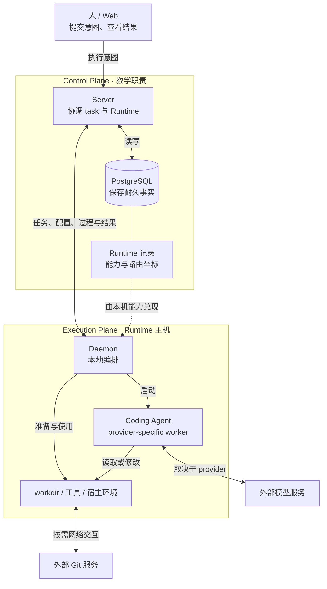
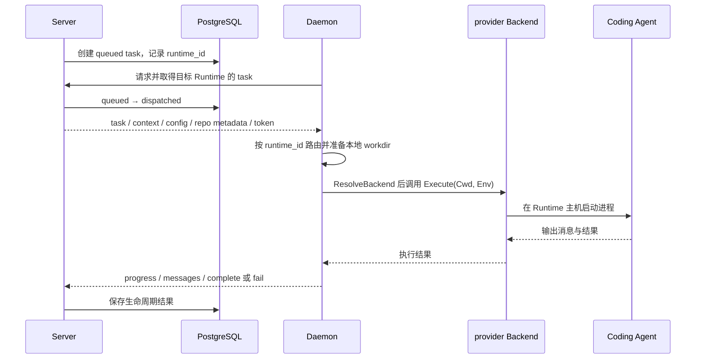

> 如果 Server 已经知道 Issue、Agent 和 Runtime，为什么不直接在服务器上启动 Coding Agent？为什么还要经过用户机器上的 Daemon？

短答案是：**Server 适合保存“应执行什么”的共享事实并协调一次执行；仓库工作目录、已安装工具和具体 Coding Agent 进程则位于 Runtime 主机，由 Daemon 在那里把“如何执行”落地。** 两边通过明确的数据与结果通道连接，而不是由 Server 把自己变成一台远程开发机。

本章用 **Control Plane（控制面）** 与 **Execution Plane（执行面）** 来描述这条职责边界。先说明一个重要限制：这是本章的**教学架构模型**。在固定上游提交中，只发现两处注释顺手使用 `control plane` 描述 Server 侧 skill-bundle 来源，没有发现成对定义的 Control Plane / Execution Plane 模块、类型或架构。因此，后文说“控制面”与“执行面”，是在归纳多处已验证职责，不是在引用两个同名源码组件。

本章基线固定为 `multica-ai/multica@10a7e519da96e8e1819934c24f89bc55a71f88b5`，只以普通 Issue 执行为代表路径。

## 如果 Server 亲自执行，会缺什么？

设想最朴素的方案：Server 收到一次执行请求，马上在自己的进程旁边启动 Codex。这样做首先要回答四个问题：

- 要修改的仓库工作树在哪台机器上？
- `codex`、`git`、`gh`、`npm` 等工具安装在哪里？
- 这些工具应该读取哪位用户的环境与登录状态？
- 多个用户、Workspace 和 Runtime 的机器差异由谁承担？

在已验证路径中，这些机器相关资源没有被搬进 Server。Server 保存 task、目标 Runtime 和生命周期事实；Daemon 在 Runtime 主机准备或选取 workdir，解析本地 provider 能力，再启动具体 Coding Agent。也就是说，系统把共享协调与机器相关执行分开了。

## 先建立一个两平面模型

下面是本章的**概念图**。中文区域表示教学职责，不是源码 package。PostgreSQL 被画在耐久协调侧；外部 Git 与模型服务则明确留在本章模型之外，因为它们可能与执行侧通信，不能被藏进“代码都在本地”这句话里。

<figure>



<figcaption><strong>CONCEPTUAL · 两平面职责：</strong>控制面回答“应执行什么”，执行面回答“怎样用这台机器的资源执行”。两个 plane 是教学模型；外部 Git / 模型服务提醒我们，本地工作目录不等于所有数据永不跨出机器。</figcaption>

</figure>

这张图有三条边界不能画成等号：

1. **Control Plane 不等于一个 Server 进程。** PostgreSQL 的耐久状态也是协调路径的一部分。
2. **Execution Plane 不等于 Daemon 一个进程。** 它还包含本地 workdir、工具、环境，以及真正工作的 Coding Agent 子进程。
3. **Runtime 不等于 Daemon。** Runtime 是 Server 可引用的持久能力 / 路由记录；Daemon 才是承载并兑现这些能力的活进程。

## 跟着一项工作跨过边界

把 M01 的旅程压缩到本章关心的边界，只剩五个语义阶段：

1. Server 保存一次待执行工作，并记录目标 Runtime。
2. Daemon 从 Server 取得这项工作；执行权由 Server 侧耐久状态交接。
3. Daemon 用 `runtime_id` 找到本机 provider 能力，准备或复用 workdir。
4. Daemon 解析 backend，在本机启动 provider-specific Coding Agent。
5. Daemon 把进度、消息与最终结果回传 Server。

下面的序列图是一张**实现图**，绑定本章固定提交。它折叠了通知、轮询、认领竞争、环境内部步骤和 provider 协议，只保留证明职责跨界的最短路径。

<figure data-wide>



<figcaption><strong>IMPLEMENTATION · 最短跨界路径：</strong>Server / PostgreSQL 先保存并交接执行事实，Daemon 才在 Runtime 主机准备 workdir、解析 backend 并启动 Coding Agent；过程与结果再返回 Server。图不解释 claim 算法或 provider protocol。</figcaption>

</figure>

这条序列最重要的不是函数顺序，而是两个不同动作：**保存可协调的执行事实**与**创建本地工作进程**。前者发生在 Server / PostgreSQL 路径，后者出现在 Daemon 调用 provider backend 的路径。

## Server 到底协调什么？

在普通 Issue 代表路径中，Server 读取目标 Agent 当前绑定的 `runtime_id`，创建一条耐久 task，并把它定向到该 Runtime。源码中的核心持久记录是 `AgentTaskQueue`，不是一个运行中的 Agent 进程。

Server 随后可以提醒目标 Runtime 有工作，但提醒本身不运行工具。Daemon 仍要向 Server 取得工作，服务端通过数据库状态把 task 从 `queued` 交接为 `dispatched`。本章只使用这一转换证明“执行权来自服务端耐久状态”；通知为什么可能丢失、Daemon 怎样轮询、并发领取为何唯一，留给 M06。

因此，控制侧在这条路径上保留的是：

- 用户与协作系统产生的执行意图；
- Agent、Runtime 绑定与 task 身份；
- task 的耐久状态和生命周期结果；
- 跨边界下发的上下文、配置与仓库元数据；
- Daemon 回传的进度、消息与终态。

“Server 负责协调”也有范围限制：它不表示 Server 永远不执行任何自动化代码。仓库里还有维护与集成功能；本章只讨论 Coding Agent execution 的这条分层。

> 源码定位
>
> - `server/internal/handler/issue_trigger.go`：`(*Handler).dispatchIssueRun`
> - `server/internal/service/task.go`：`(*TaskService).enqueueIssueTaskWithCommentPlan`
> - `server/pkg/db/generated/models.go`：`AgentRuntime`, `AgentTaskQueue`
> - `server/pkg/db/queries/agent.sql`：`ClaimAgentTask`

## Runtime 为什么不是“正在运行的那个进程”？

M02 已经把 Runtime 与 Daemon 分开。本章再补一层执行含义：`AgentRuntime` 是 Server 侧的持久记录，保存 Workspace、Daemon ID、provider、profile、状态与设备信息等；Daemon 注册本机探测到的能力后，Server 创建或更新这些 Runtime 行。

一个 Daemon 的 `runtimeIndex` 可以包含多个 Runtime ID。任务跨界时带着 `RuntimeID`，`handleTask` 用它找到本机对应的 provider。于是 Runtime 更像一份稳定的能力 / 路由坐标，Daemon 则是读取这个坐标、真正承载执行的活进程。

这仍然没有回答 heartbeat、掉线、重连或恢复：数据库里存在一条 Runtime 记录，不足以单独证明对应 Daemon 此刻可用。完整生命周期属于 M07。

> 源码定位
>
> - `server/pkg/db/queries/runtime.sql`：`UpsertAgentRuntime`, `UpsertAgentRuntimeWithProfile`
> - `server/internal/daemon/daemon.go`：`runtimeIndex`, `(*Daemon).handleTask`

## Daemon 怎样把记录变成本地进程？

Daemon 取得的不是一条从 Server 原样转发的 shell command。claim payload 包含 task、Runtime、Workspace、Agent 身份，还带有配置、仓库 / Project 元数据、上下文和 task-scoped credential。

在本机，Daemon 依次做三类工作：

1. 按 `task.RuntimeID` 找到本机 provider 能力；
2. 通过 `execenv.Prepare` 或复用路径取得 workdir，并准备当前执行需要的本地环境；
3. 用 `ResolveBackend` 解析具体 backend，把 `Cwd`、环境和 executable path 交给统一执行接口。

Codex 是一个可验证实例：`codexBackend.executeOnce` 在 Daemon 侧启动 `codex app-server --listen stdio://`，并设置本地工作目录与环境。这证明具体 Coding Agent 进程在执行侧启动；它不证明所有 provider 都使用 Codex 的命令或 stdio protocol。

> 源码定位
>
> - `server/internal/daemon/types.go`：`Task`, `AgentData`
> - `server/internal/daemon/daemon.go`：`(*Daemon).runTask`
> - `server/internal/daemon/execenv/execenv.go`：`Prepare`
> - `server/pkg/agent/builtin_runtimes.go`：`ResolveBackend`
> - `server/pkg/agent/codex.go`：`(*codexBackend).executeOnce`

## 跨边界传什么，什么留在执行位置？

“分层”不表示两边断开。当前实现会持续交换控制数据与执行结果：

| 方向 | 已验证内容 | 不能据此推出什么 |
| --- | --- | --- |
| Server → Daemon | task / Runtime / Workspace / Agent 身份、context、config、repo metadata、task-scoped token | 不是只发送一条无状态命令；也不表示所有本地文件都被下发 |
| Daemon → Server | progress、messages、complete / fail、branch / session / workdir 等结果元数据 | 不表示 workdir 内容整体上传；也不表示任何路径或 diff 都永不跨界 |
| Runtime 主机内部 | workdir、provider CLI 进程、宿主工具与环境解析 | 不保证 provider 或 Git 永不与外部服务交换数据 |

普通 managed environment 的 workdir 起初为空；repo URL / ref 等元数据可以跨界，真实 checkout 则通过 Daemon 的 localhost endpoint 落到本机 cache / workdir。子进程的 `Cwd` 也是本机 `env.WorkDir`。

所以，“代码留在本地”在本章中只能严格表达为：**Multica 在 Runtime / Daemon 主机准备工作目录，并在这里启动 provider CLI；Server 协调 task、配置和元数据，不在代表路径中创建这份源代码工作树。**

它不是一份对所有外部流量的保证。Git remote 本身可能是外部服务；Coding Agent 也可能把上下文发送给模型服务。本章没有审计 provider 的数据处理方式，不能把上游 README 的 “Code never leaves it” 扩大成完整隐私结论。

## 凭据也没有一个简单的“本地 / 远端”答案

凭据必须按来源和用途拆开：

| 类别 | 当前已验证边界 |
| --- | --- |
| task-scoped Multica token | Server 在 claim 时签发，Daemon 注入 `MULTICA_TOKEN`，让子进程以 task / Agent 身份调用 Multica，而不是继承 Daemon owner credential |
| 宿主 ambient credentials | 本机工具继续通过 Daemon 用户的 `HOME` / XDG 状态解析；它们存在于宿主环境 |
| Server-managed Agent 配置 | `custom_env`、MCP / connected-app 配置可以由 Server 保存并随 task 下发，再由 Daemon 过滤、合并或物化 |
| Daemon-only token | `RemoteMCPDaemonToken` 被明确限制在 Daemon，不进入 Agent env / config；这是字段级保证 |

因此，不能说“所有凭据都只在本地”。有些凭据来自 Server，有些来自宿主环境，有一个已验证字段只留给 Daemon。完整 secret 存储、加密、redaction 与威胁模型不属于本章。

## 为什么值得分开？

以下结论是有证据支撑的**工程解释（INFERENCE）**，不是一条源码注释直接声明的作者动机：

> 把两侧分开，使共享协作状态不必寄托在某台机器的进程内存中；同时，仓库、工具、可执行文件与机器相关环境可以在真正具备它们的主机上被解析和使用。

支撑这条解释的事实是：Server / PostgreSQL 持久保存 task 与 Runtime 绑定；Daemon 负责 workdir、工具探测、backend 解析和进程启动；官方文档也把 Runtime 描述为用户控制的机器，并把 Daemon 放在代码旁边。

代价是两侧必须通过协议交接身份、配置、执行权与结果，也必须处理机器离线、重复发现和失败恢复。那些机制很重要，但分别属于后续调度、Runtime 生命周期与可靠性章节。

## 容易混淆的六件事

1. **两个 plane 是教学模型，不是正式源码模块。** 不要寻找一个并不存在的 `control-plane` package。
2. **Server 负责协调，不代表它是 Coding Agent 进程宿主。** 当前代表路径中的 provider process 在 Daemon 侧启动。
3. **Runtime 不是 Daemon。** 前者是持久能力 / 路由记录，后者是活的本地进程。
4. **Daemon 不是 Coding Agent。** Daemon 准备环境并调用 backend；Codex 等 worker 才承担具体代码工作。
5. **workdir 在本地，不等于所有代码字节永不离机。** 外部 Git 与模型 provider 有自己的网络边界。
6. **凭据不全属于一个位置。** task token、宿主 ambient credentials、Server-managed 配置和 Daemon-only token 的边界不同。

## 本章刻意没有展开什么？

- heartbeat、在线 / 离线、注册恢复与 Daemon 生命周期：留给 M07；
- wakeup、polling、claim 竞争与并发所有权：留给 M06；
- workdir 隔离、worktree、清理与资源注入内部：留给 M08；
- provider protocol、各 adapter 差异与 custom runtime：留给 M10；
- retry、stale task、断网恢复：留给 M13；
- 完整 credential threat model：需要 M18 或独立安全研究。

M03 是当前冻结窗口的最后一章；下一章尚未冻结，需要人类编辑复核，而不是按编号自动进入 M04。

## 5 分钟快速复习

试着不用函数名回答：

1. Control Plane 与 Execution Plane 各回答什么问题？为什么它们只是教学模型？
2. Server 保存 task 与 Daemon 启动 Coding Agent 有什么区别？
3. Runtime 记录、Daemon 进程和 Coding Agent worker 为什么不能画等号？
4. 跨 Server / Daemon 边界会传递哪些数据？
5. “代码留在本地”能严格证明到哪一步，不能保证什么？
6. 四类凭据的来源和作用位置有什么不同？
7. 面对一个新 provider，需要重新核验哪些源码关系，才能判断执行仍发生在本机？

如果能说出下面这句话，就掌握了本章模型：

> Server 与 PostgreSQL 保存并协调“应执行什么”；Runtime 记录给出能力与路由坐标；Daemon 在对应主机准备 workdir、解析 backend 并启动 Coding Agent，再把过程和结果交还 Server。

---

## 附录：源码导航

下面的准确标识符用于核对固定提交，不是理解正文前需要背诵的术语。

### Source Map

| 源码位置 | 关键 symbol | 证明什么 | 证据 |
| --- | --- | --- | --- |
| `server/pkg/taskfailure/failure.go` | `ReasonSkillBundleUnavailable` 注释 | `control plane` 只在 skill-bundle 语境零散出现，不是成对正式架构定义 | `SOURCE` |
| `server/internal/handler/issue_trigger.go` | `(*Handler).dispatchIssueRun` | 普通 Issue 直接 Agent 路径进入 TaskService，而不是启动 provider process | `SOURCE` |
| `server/internal/service/task.go` | `(*TaskService).enqueueIssueTaskWithCommentPlan` | 创建耐久 task、复制 `runtime_id` 并通知目标 Runtime | `SOURCE` |
| `server/pkg/db/generated/models.go` | `AgentRuntime`, `AgentTaskQueue` | 区分 Runtime 持久记录与一次执行 task | `SOURCE` |
| `server/pkg/db/queries/runtime.sql` | `UpsertAgentRuntime`, `UpsertAgentRuntimeWithProfile` | Daemon 能力注册为 Workspace-scoped Runtime 行 | `SOURCE` |
| `server/pkg/db/queries/agent.sql` | `ClaimAgentTask` | Server / 数据库交接 `queued → dispatched` 执行权 | `SOURCE` |
| `server/internal/daemon/types.go` | `Task`, `AgentData` | claim payload 携带跨界身份、配置、repo metadata 与 token | `SOURCE` |
| `server/internal/daemon/daemon.go` | `(*Daemon).handleTask`, `(*Daemon).runTask` | 按 Runtime 路由、本机准备执行并调用 provider | `SOURCE` |
| `server/internal/daemon/execenv/execenv.go` | `PrepareParams`, `Environment`, `Prepare` | 在 Daemon 主机建立 env root / workdir 并准备本地配置 | `SOURCE` |
| `server/pkg/agent/agent.go` | `Backend`, `ExecOptions`, `Config` | 统一的本地 provider 执行边界包含 cwd、env 与 executable path | `SOURCE` |
| `server/pkg/agent/builtin_runtimes.go` | `ResolveBackend` | 把 Runtime / provider identity 解析为具体 backend | `SOURCE` |
| `server/pkg/agent/codex.go` | `codexBackend`, `(*codexBackend).executeOnce` | Codex 实例在 Daemon 主机启动子进程 | `SOURCE` |
| `server/internal/daemon/health.go` | `activeRepoCheckoutTask`, `(*Daemon).repoCheckoutHandler` | repo checkout 通过 localhost endpoint 进入本机 owned workdir | `SOURCE` |
| `server/internal/daemon/client.go` | `ReportProgress`, `ReportTaskMessages`, `CompleteTask`, `FailTask` | Daemon 把过程与结果回传 Server | `SOURCE` |
| `README.md` | `Your own runtime`; architecture diagram | 产品语义中的用户控制 Runtime 与 Daemon → agent CLI 边界 | `DOCS` |

### 精确执行 / 调用链

下面保留本章需要的 happy path；通知、poll / claim 算法、环境内部与 provider session 细节均按章节边界省略：

```text
Issue trigger
  → Handler.dispatchIssueRun
  → TaskService.enqueueIssueTaskWithCommentPlan
  → AgentTaskQueue(status = queued, runtime_id, ...)
  → notifyRuntimeMayHaveWork(runtime_id)
  → Daemon 向 Server claim
  → ClaimAgentTask: queued → dispatched
  → Task{RuntimeID, WorkspaceID, AgentData, Repos, AuthToken, ...}
  → Daemon.handleTask: runtimeIndex[RuntimeID]
  → Daemon.runTask
  → execenv.Prepare / Reuse
  → taskMulticaEnvironment + local/provider env
  → agent.ResolveBackend(...)
  → Backend.Execute(..., ExecOptions{Cwd: env.WorkDir})
  → Codex 实例：codex app-server --listen stdio://
  → ReportProgress / ReportTaskMessages / CompleteTask | FailTask
```

### 源码基线、研究依据与未决问题

- 上游仓库：`multica-ai/multica`
- 完整 commit SHA：`10a7e519da96e8e1819934c24f89bc55a71f88b5`
- 研究产物：`research/control-execution-plane/research-note.md`
- 图示证据：`research/control-execution-plane/diagram-evidence.md`
- 证据类型：职责、数据边界、文件系统位置与进程创建以 `SOURCE` 为主；产品 Runtime 与本地代码位置参考固定提交内 `README.md` 的 `DOCS`；本章没有新增 `EXPERIMENT`。
- `INFERENCE`：两个 plane 的命名与“分层让共享状态独立于单机进程，同时让机器相关资源留在使用位置”是基于已验证职责的教学归纳，不是正式源码模块或作者动机声明。

当前未决问题包括：所有 trigger 是否共享完全相同的入队路径；Runtime heartbeat / 恢复全生命周期；poll / claim 的并发与恢复机制；execution environment 的完整隔离与清理；provider 的外部数据路径；完整 credential threat model；custom runtime 的全部协议语义。升级上游版本时，至少要重新核验 task 创建与 Runtime 绑定、claim payload、Daemon workdir 准备、backend 解析、进程创建、凭据注入和结果回传这些证据。
