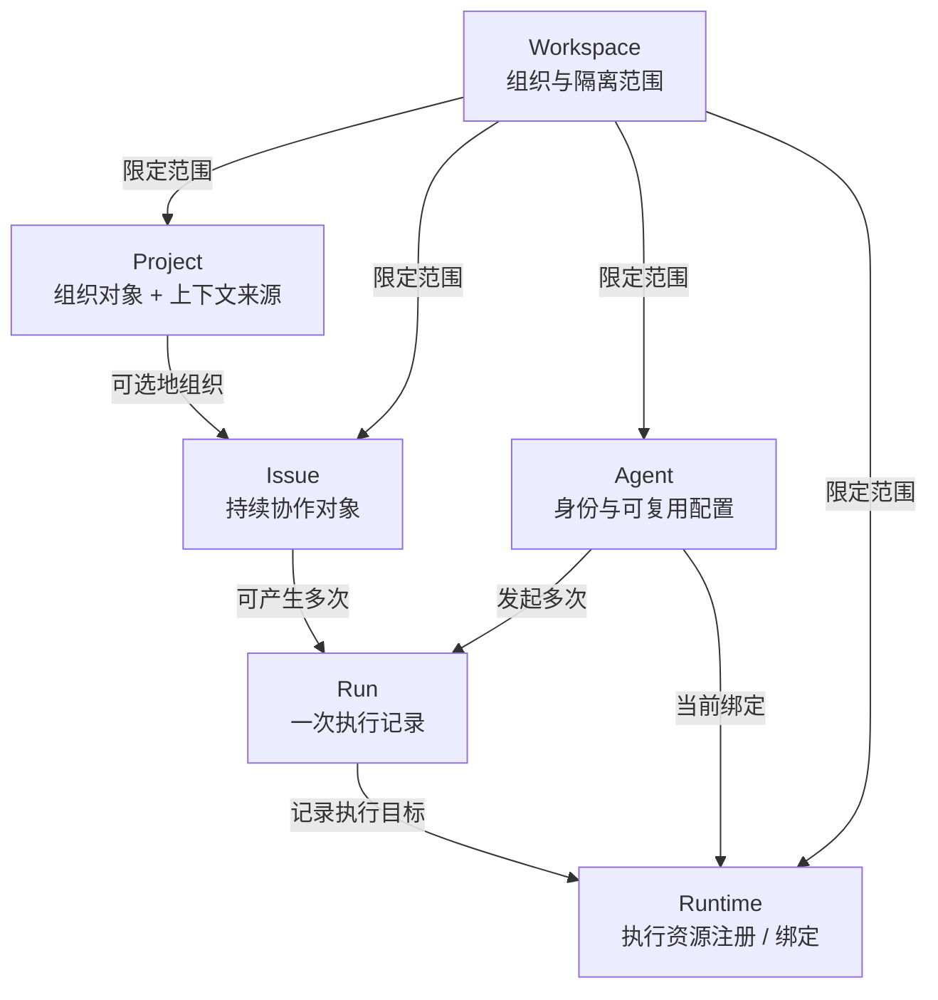
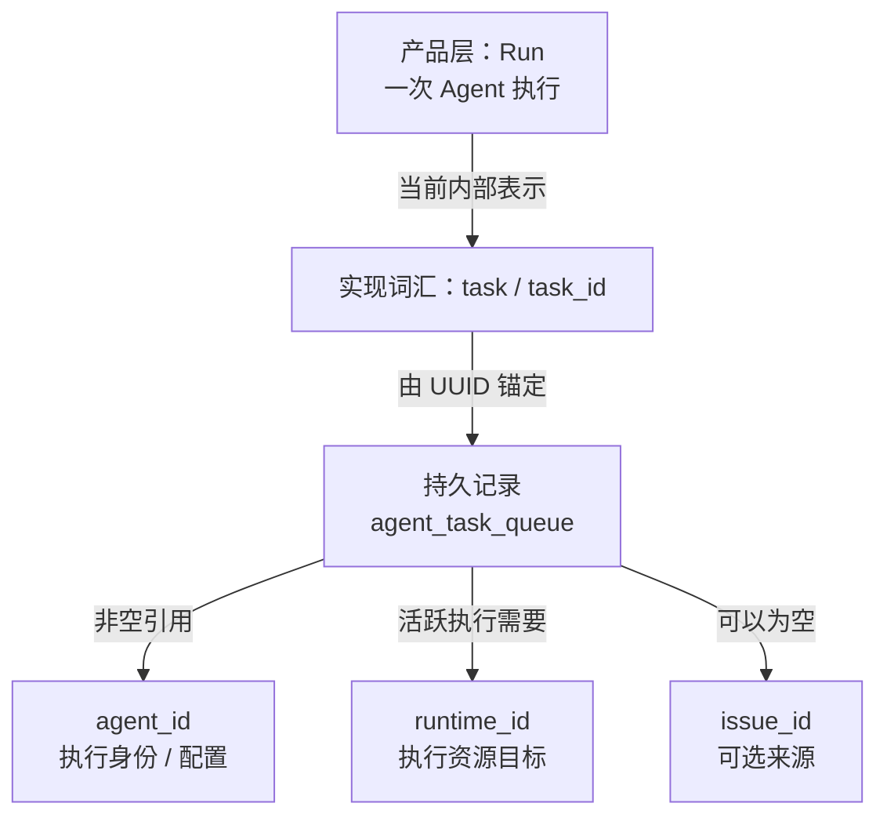
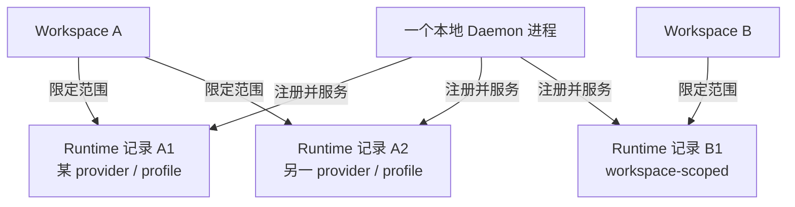

> M01 里，一个 Issue 经过 Server、Daemon 和 Coding Agent 跑了起来。可这些名字到底指什么？为什么界面说 Run，源码却到处写 task？Runtime 又是不是那台正在运行 Daemon 的电脑？

短答案是：**这些词来自不同观察层。** Workspace 和 Project 组织工作，Issue 保存持续协作，Agent 保存“谁来做、怎样做”的可复用配置，Run 记录“一次具体执行”，Runtime 指向这次执行可使用的资源，而 Daemon 是在本地兑现这些资源的活进程。

它们会通过 ID 发生关系，却不是同一个东西的六种叫法。理解本章最重要的一句话是：

> **产品概念 ≠ 源码类型 ≠ 数据库记录 ≠ 运行中的资源。**

本章固定在 `multica-ai/multica@c76a012dc70da037372159bbd19a4f69f0120783`。我们先用读者视角整理对象，再把它们放回 M01 的执行旅程，最后才查看准确源码坐标。

## 先学会换镜头

假设页面上显示“Agent 开始了一次 Run”。这句话至少可以从四个角度观察：

| 镜头 | 关心的问题 | 本章中的例子 |
| --- | --- | --- |
| 产品概念 | 用户在操作或查看什么？ | Agent、Run、Runtime |
| 源码类型 | 程序用什么结构传递数据？ | `db.Agent`、`AgentTask` |
| 数据库记录 | 哪一行持久保存身份、关系或状态？ | `agent`、`agent_task_queue` |
| 运行中的资源 | 哪个活进程和本地工具真正执行？ | Daemon 与 Coding Agent |

名称相近，不代表可以画等号。例如，产品把一次执行称为 Run；当前内部调度、API 和数据库主要沿用 task 术语。反过来，源码里出现带 `Run` 的名字，也不代表它就是这次执行的通用持久对象。

这套“换镜头”的方法比背字段更重要。以后遇到新名词，可以先问：它在描述产品语义、程序表示、持久事实，还是正在工作的资源？

## 一张对象地图

先把 M01 暂停在“用户准备把工作交给 Agent”的时刻。下面是本章的**概念图**：它用自然语言给对象分类，关系来自固定基线的已验证模型，但节点不是源码类型声明。

<figure>



<figcaption><strong>CONCEPTUAL · 六对象地图：</strong>Workspace 给对象划定组织范围；Issue、Agent、Run 和 Runtime 分别回答“做什么”“谁来做”“哪一次执行”“在哪里执行”。Project 主要组织工作，也能提供执行上下文。实现层的精确关系与例外见后文。</figcaption>

</figure>

可以先把六个对象压缩成五类：

| 类别 | 对象 | 它主要回答什么？ |
| --- | --- | --- |
| 组织范围 | Workspace | 这些工作、配置和历史属于哪个协作边界？ |
| 组织对象 / 上下文来源 | Project | 哪些 Issue 围绕共同目标组织？执行时可得到哪些项目背景？ |
| 协作对象 | Issue | 要完成什么工作？讨论、状态和负责人如何持续变化？ |
| 编排身份与配置 | Agent | 由哪个 AI 协作者、带着什么配置来工作？ |
| 执行记录 | Run | 这一次执行本身发生了什么？ |
| 执行资源 | Runtime | 这一次执行被绑定到哪份机器与工具能力？ |

下面跟着一个例子，把这些分类变成可用的判断方法。

## 同一个 Issue，为什么可以有两次 Run？

设想一个 Workspace 里有“升级支付服务”Project，其中有一个 Issue：更新 SDK 并修复兼容性测试。这个 Issue 被分配给一个代码维护 Agent，Agent 当前绑定到开发者 Mac 上的 Codex Runtime。

第一次执行修改了依赖，但测试失败。人补充一条评论后又让 Agent 继续，于是出现第二次执行。此时：

- **还是同一个 Issue**：目标、讨论和协作状态持续存在；
- **还是同一个 Agent 身份**：它的名称、instructions、模型与执行设置可以复用；
- **出现了两条 Run 记录**：每次执行都有自己的 ID、状态、时间与结果；
- **两次 Run 可能指向同一 Runtime**：它们可以在同一份执行资源上先后发生，但不会因此合成同一次执行。

因此，Issue 不是 Run。Issue 是一件工作的持续协作记录，一个 Issue 可以积累多次执行历史。一次 Run 完成，也只说明这一轮 Agent 执行结束，不等于 Issue 已经通过验收。

固定基线中的 `ListTasksByIssue` 正是按 Issue 查询多条 task 历史。这里的 task 是实现词，下一节会解释它与产品 Run 的关系。

## 六个对象分别守住什么边界？

### Workspace：不是本地工作目录

Workspace 是团队、工作和配置相互隔离的顶层组织范围。Project、Issue、Agent 和 Runtime 的主要持久记录都直接带有非空 `workspace_id`。

Run 历史在产品语义上也属于 Workspace，但实现方式更值得留意：核心 `agent_task_queue` 行没有自己的 `workspace_id`。用户侧的 workspace 查询与授权会通过非空 `agent_id` 连接到 `agent.workspace_id`。所以“Workspace 包含 Run 历史”是正确的产品表达，却不能机械地推导为“每张相关表都有 `workspace_id`”。

Workspace 也不是 Git checkout、仓库目录或 Daemon 的工作目录。那些属于后续执行环境问题。

### Project：不只是一个分类文件夹

Project 围绕共同目标组织多个 Issue。一个 Issue 的 `project_id` 可以为空，也就是它可以不属于任何 Project；删除 Project 时，相关 Issue 会脱离 Project，而不是跟着被删除。

但 Project 也不只是页面上的分组。执行领取阶段，`resolveClaimProjectContext` 会把 Project 的 ID、标题、描述和经过 Workspace 过滤的资源加入执行上下文；存在项目级 GitHub repo 时，它优先于 Workspace repo。

所以 Project 最准确的工作分类是：**主要负责组织，同时也是执行上下文的来源。** 它会影响 Agent 得到的背景，却不拥有或启动执行进程。

### Issue：保存工作与协作，不保存“一次进程”

Issue 的持久锚点是 `issue` / `db.Issue`。它保存工作目标、描述、状态、讨论关联、Project 归属、父子关系以及负责人等持续信息。

负责人不是一个固定的 `agent_id` 外键，而是 `assignee_type` 与 `assignee_id` 组成的多态引用。当前产品可以把工作分给 member、agent 或 squad；标准 HTTP 路径由 `validateAssigneePair` 检查两者成对、目标存在并属于同一 Workspace。本章只需要记住：**Issue 的负责人关系比“指向 Agent”更一般。** 具体触发规则留给后续章节。

### Agent：不是一直运行着的 AI 进程

Agent 是 Workspace 内可复用的 AI 协作者身份与配置。名称、instructions、模型、权限模式、skills、并发限制和 Runtime 绑定等，都属于“下一次工作应怎样执行”的配置面。

Agent 本身不需要常驻运行。工作到来时，系统新建 Run；真正执行时，本地 Daemon 再启动相应 Coding Agent。一个 Agent 可以先后产生很多 Run，一个 Runtime 也可以被多个 Agent 配置引用。

当前 `agent.runtime_id` 表示 Agent 的当前执行资源绑定：一条 Agent 记录至多绑定一个 Runtime，也可能在 Runtime 被删除后暂时处于 unbound 状态。这个“当前绑定”不要与历史 Run 保存的执行目标混为一谈。

### Run：产品眼中的一次执行

Run 回答的是：“这一次 Agent 执行发生了什么？”它有自己的 ID、状态、时间、结果或错误，也可以保留 session、workdir 与 lineage 等执行信息。

对 Issue 触发的普通执行，系统会新建一条记录，同时保存：

- `agent_id`：这次由哪个 Agent 身份与配置发起；
- `runtime_id`：这次执行当时指向哪个 Runtime；
- `issue_id`：这次执行来自哪个 Issue。

这里的 `issue_id` 可以为空。聊天或 Autopilot 等其他来源也能产生执行，因此不能把所有 Run 都定义成“Issue 的执行”。本章只用 Issue-linked Run 作为连接 M01 的具体例子，不展开其他来源。

### Runtime：不是 Agent，也不是一次 Run

Runtime 是某个 Workspace 可使用的执行资源记录。产品语义可以把它理解为“一台计算机 + 一个 AI coding tool”，或者这台机器上的一个自定义 profile；实现中的持久锚点是 `agent_runtime` / `db.AgentRuntime`，保存 `workspace_id`、`daemon_id`、provider/profile、状态和最近活动等信息。

Agent 通过当前 `runtime_id` 选择执行资源；Run 又把创建当时的 `runtime_id` 保存进自己的记录。两条边必须分开看：

```text
Agent → Runtime：下一次工作当前应使用的配置绑定
Run   → Runtime：这一条执行记录实际保存的目标
```

以后重新绑定 Agent，并不会让过去的 Run 变成新的执行；历史记录与当前配置不是同一个对象。

## 为什么界面说 Run，源码却写 task？

这是产品词汇与实现词汇的有意分层，不是两个执行系统。

固定基线的产品文档使用 **Run** 表示一次 Agent 执行；内部调度、API 和数据库主要沿用 **task**：核心持久记录是 `agent_task_queue` 行，Go 生成类型是 `db.AgentTaskQueue`，共享前端边界使用 `AgentTask`，服务入口则叫 `TaskService`。一次执行的稳定锚点是 task UUID，也就是 `AgentTaskQueue.ID` / `task_id`。

<figure>



<figcaption><strong>IMPLEMENTATION · Run 与 task：</strong>产品 Run 在当前核心实现中落到 task-oriented 的持久记录；<code>task_id</code> 锚定一次执行。<code>issue_id</code> 可空，所以 Run 不只来自 Issue。</figcaption>

</figure>

在固定提交的 `server/`、`packages/` 和 `apps/` 范围内，研究没有发现一个替代 task 持久模型的通用 Agent `Run` 类型。前端的 `TimelineRun` 等名字是包裹 `AgentTask` 的展示模型；`AutopilotRun` 等则属于其他领域。这个负面结论只适用于所查提交与范围，不能被扩写成“源码中永远没有任何 Run 类型”。

因此，正文继续用读者熟悉的 Run；进入源码导航时，则保留真实的 task 标识符。不要为了统一措辞，虚构一个不存在的中心 `Run` 类型。

## 为什么 Runtime 不等于 Daemon？

Runtime 有持久的一面：Server 保存一条可被 Agent 与 Run 引用的执行资源记录。Daemon 有活的一面：它是本地后台进程，负责发现工具、注册 Runtime、领取工作、启动工具并回传结果。

两者有关联，却不是一一对应。一个 Daemon 可以连接多个 Workspace，也可以在一台机器上发现多个 provider/profile。源码里的 `runtimeIndex map[string]Runtime` 会同时按多个 Runtime ID 路由。因此，同一个 Daemon 进程可以承载多条 Workspace/provider Runtime 记录。

<figure>



<figcaption><strong>IMPLEMENTATION · Runtime 与 Daemon：</strong>一条 Runtime 记录属于一个 Workspace，并保存 <code>daemon_id</code> 与 provider/profile 信息；一个活 Daemon 可以注册并服务多条 Runtime 记录，所以“Runtime = Daemon = 整台机器”都不成立。</figcaption>

</figure>

教学上可以说“Daemon 兑现 Runtime 所代表的能力”。这是一句架构抽象，不是说源码中存在同名的“兑现”方法，也不代表数据库记录本身会执行代码。

## 把对象放回 M01 的旅程

现在重新读 M01 的主线，每一步都能说清“哪个对象保持不变，哪个对象刚刚产生”：

1. 用户在一个 **Workspace** 中查看某个 **Project** 里的 **Issue**。
2. Issue 被分配给 **Agent**。这改变的是协作关系；Agent 仍是身份与配置，不是进程。
3. 满足触发条件后，系统新建一条 **Run**。实现中是一条拥有新 `task_id` 的 task 记录。
4. 这条记录同时保存 `agent_id`、当时的 `runtime_id` 与可选 `issue_id`，没有把 Issue、Agent 或 Runtime 本身改造成“运行中”。
5. **Daemon** 根据 Runtime ID 在本地找到对应 provider/profile，并在后续流程中承载真实执行。
6. Run 到达终态后，执行历史留在 Workspace 的产品范围内；Issue 的协作生命周期仍可继续。

用一句话概括：

> Issue 提供持续工作的上下文，Agent 提供可复用的执行身份与配置，Runtime 提供执行资源绑定，Run 则把“这一次”单独记录下来；Workspace 与 Project 在外层提供组织范围和上下文。

这正是 M02 对 M01 地图的放大。后面的章节可以继续讨论控制面与执行面、调度或 Daemon 生命周期，而不必再把这些对象混在一起。

## 三条必须保留的证据边界

### 1. Workspace scope 不是每张表一个字段

Project、Issue、Agent 和 Runtime 直接保存 `workspace_id`；核心 task 通过 owning Agent 间接取得 Workspace scope。研究验证了普通用户侧查询与快照路径，但没有审计所有 task 创建入口是否始终保持 Agent、Issue 与 Runtime 位于同一 Workspace。跨 Workspace 的全路径不变量属于后续权限与 task-scoped identity 研究。

所以本章不会声称“数据库从结构上保证所有相关 ID 永远同 Workspace”。

### 2. retry / rerun 不一定沿用同一 Runtime

普通 Issue 入队路径会把 Agent 当时的 `runtime_id` 复制到新 task。研究没有证明所有 retry / rerun 入口都会沿用旧 Runtime，也没有证明它们都会重新读取 Agent 的当前绑定。

所以遇到重试或重新运行，不能仅凭本章推断目标 Runtime；需要沿具体入口继续验证。

### 3. Runtime 的持久状态不等于 Daemon 的完整生命周期

本章只验证 Runtime 记录、Daemon 的多 Runtime 索引与注册关系。离线、解绑、archive/restore、heartbeat freshness 与故障恢复的完整语义留给 M07。数据库中有 Runtime 行，不足以单独证明此刻一定有活 Daemon 能执行它。

## 容易混淆的八件事

1. **Workspace 不是 workdir。** 前者是组织与隔离范围，后者是一次执行使用的本地目录概念。
2. **Project 不是执行器。** 它组织 Issue，并能贡献描述与资源上下文，但不启动 Agent。
3. **Issue 不是 Run。** 一件持续工作可以先后产生多次执行。
4. **assignee 不总是 Agent。** typed assignee 也可以指向 member 或 squad。
5. **Agent 不是常驻进程。** 它是可复用身份与配置，工作到来时才产生 Run。
6. **Run 不是 Runtime。** 前者是一次执行记录，后者是执行资源注册与绑定。
7. **产品 Run 不等于源码中心 `Run` 类型。** 当前核心实现主要使用 task、`AgentTaskQueue` 与 `task_id`。
8. **Runtime 不等于 Daemon。** 一条是可引用的持久资源记录，一个是本地活进程；一个 Daemon 可以服务多条 Runtime 记录。

## 5 分钟快速复习

试着不看函数名回答：

1. Workspace、Project、Issue、Agent、Runtime 和 Run 分别回答什么问题？
2. 为什么一个 Issue 可以有多次 Run？
3. 为什么 Agent 重新绑定 Runtime，不会把历史 Run 变成新的执行？
4. Project 为什么不只是 Issue 文件夹，又为什么不是执行器？
5. 产品 Run 在当前实现里由什么 ID 锚定？
6. 为什么一个 Daemon 可以对应多条 Runtime 记录？
7. 为什么不能从本章推断所有 retry / rerun 一定选择同一个 Runtime？
8. 遇到一个新名词时，怎样判断它属于产品概念、源码类型、数据库记录还是运行资源？

如果能说出下面这句话，就掌握了本章模型：

> Workspace 划定范围，Project 组织目标并提供上下文，Issue 保存持续协作，Agent 保存可复用身份与配置，Run 记录一次执行，Runtime 记录执行资源绑定，而 Daemon 在本地兑现这份能力。

---

## 附录：源码导航

下面的路径用于核对固定提交，不是理解正文前必须背诵的目录。

### Source Map

| 源码位置 | 关键 symbol | 证明什么 | 证据 |
| --- | --- | --- | --- |
| `server/pkg/db/generated/models.go` | `Workspace`, `Project`, `Issue`, `Agent`, `AgentRuntime`, `AgentTaskQueue` | 六对象在数据库生成层的字段边界；task 无 `workspace_id` 且 `issue_id` 可空 | `SOURCE` |
| `server/migrations/034_projects.up.sql` | `project`, `issue.project_id` | Project 属于 Workspace，Issue 可选关联 Project，删除时脱离 | `SOURCE` |
| `server/migrations/065_project_resources.up.sql` | `project_resource` | Project 可以持久绑定资源指针 | `SOURCE` |
| `server/internal/handler/project_resource.go` | `resolveClaimProjectContext` | Project 描述与资源进入领取时的执行上下文 | `SOURCE` |
| `server/internal/handler/issue.go` | `Handler.validateAssigneePair` | typed assignee 的成对与 Workspace 校验 | `SOURCE` |
| `server/pkg/db/queries/agent.sql` | `CreateAgentTask`, `GetAgentTaskInWorkspace`, `ListWorkspaceAgentTaskSnapshot`, `ListTasksByIssue` | Agent、Runtime、Issue 与 task 的连接；task 的间接 Workspace scope；Issue 的多次执行历史 | `SOURCE` |
| `server/internal/service/task.go` | `TaskService.enqueueIssueTaskWithCommentPlan` | Issue-linked Run 创建时写入 Agent、Runtime 与 Issue ID | `SOURCE` |
| `server/internal/handler/agent.go` | `Handler.CreateAgent` | 创建 Agent 时在 Workspace 内解析 Runtime，形成配置绑定 | `SOURCE` |
| `server/pkg/db/queries/runtime.sql` | `UpsertAgentRuntime`, `UpsertAgentRuntimeWithProfile`, `ListAgentRuntimes` | Runtime 按 Workspace、Daemon、provider/profile 注册并持久化 | `SOURCE` |
| `server/internal/daemon/daemon.go` | `Daemon.runtimeIndex`, `allRuntimeIDs`, Workspace registration loop | 一个 Daemon 维护多个 Workspace 的多个 Runtime ID | `SOURCE` |
| `packages/core/types/agent.ts` | `AgentTask` | 前端共享边界仍以 task 表示核心 Run 数据 | `SOURCE` |
| `packages/views/issues/components/issue-run-timeline.ts` | `TimelineRun` | 产品展示模型可以使用 Run 名称并包裹 `AgentTask` | `SOURCE` |
| `apps/docs/content/docs/concepts.mdx` | Basic objects; Agents and execution | 产品对象定义与高层关系 | `DOCS` |
| `apps/docs/content/docs/developers/architecture.mdx` | task versus product Run terminology | 产品 Run 与内部 task 的术语边界 | `DOCS` |
| `apps/docs/content/docs/daemon-runtimes.mdx` | Daemon vs runtime | Daemon 进程与 Workspace-scoped Runtime 的区别 | `DOCS` |

### 对象关系的最短实现路径

下面只保留本章需要的对象关系，不展开触发、queue、claim、provider 与 heartbeat：

```text
Issue(workspace_id, optional project_id,
      assignee_type = 'agent', assignee_id)
  → enqueueIssueTaskWithCommentPlan 读取 assignee Agent
  → 读取 Agent 当前 runtime_id
  → CreateAgentTaskParams(agent_id, runtime_id, issue_id, ...)
  → agent_task_queue 新建一条拥有独立 task ID 的记录
  → resolveClaimProjectContext 按同一 Workspace 解析可选 Project 上下文
  → 本地 Daemon 用 task.runtime_id 在 runtimeIndex 中定位 provider/profile
```

这条路径最重要的结论不是函数顺序，而是：系统新建一条同时引用 Agent、Runtime 和可选 Issue 的独立执行记录；它没有把任何一个被引用对象变成 Run。

### 源码基线、研究依据与未决问题

- 上游仓库：`multica-ai/multica`
- 完整 commit SHA：`c76a012dc70da037372159bbd19a4f69f0120783`
- 研究产物：`research/product-source-object-model/research-note.md`
- 证据类型：对象字段、持久关系、入队写入、Project context 与 Daemon 多 Runtime 索引来自 `SOURCE`；产品对象定义、Run/task 术语和高层关系同时使用该提交内官方文档的 `DOCS`；本章没有新增 `EXPERIMENT`。
- 教学分类：“范围 / 协作 / 配置 / 记录 / 资源”是建立心智模型的教学抽象，不是源码 enum。
- `INFERENCE` 边界：Project 的复合分类、Daemon“兑现”Runtime 能力等措辞，是对已验证关系的教学归纳，不是作者动机或同名源码 API。

当前研究仍未证明：所有 task 创建入口都保持跨对象的 Workspace 不变量；不同 retry / rerun 入口怎样选择 Runtime；Runtime 离线、解绑与恢复的完整生命周期；Project resources 怎样最终落到本地 repo/workdir；Workspace context 怎样拼入 prompt。本章保留这些问题，不用看似顺滑的实现细节补齐它们。
