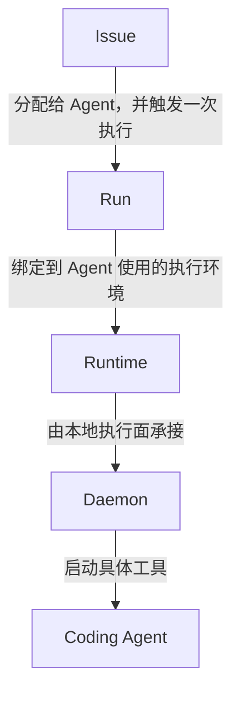
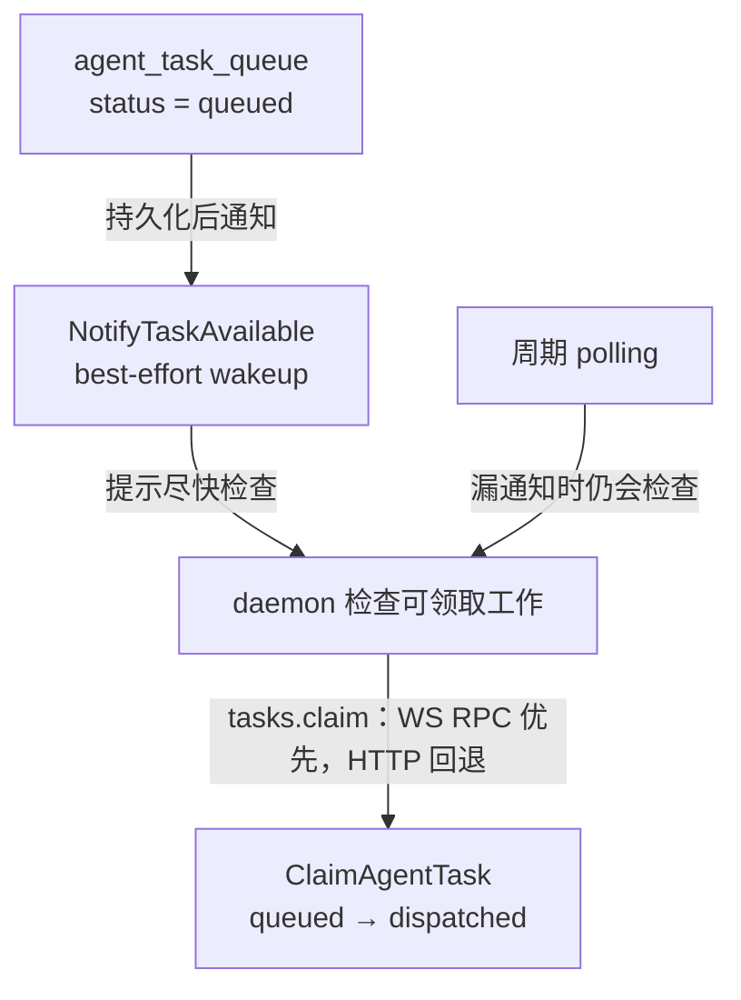
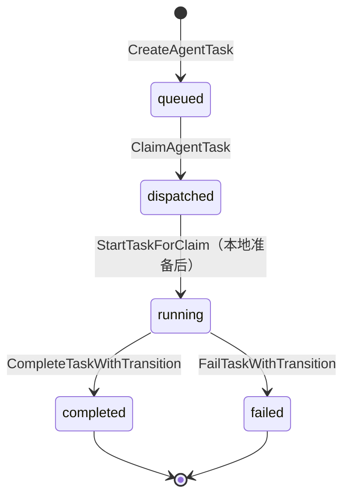

> 我只是在 Multica 中把一个 Issue 分配给 Agent，为什么几秒之后，我的 Mac 上就真的开始运行 Codex 了？

这不是一次从浏览器直接发往 Codex 的“远程点击”。中间至少发生了三类交接：服务端先把执行意图写成持久任务，本地 daemon 再从服务端认领任务，最后 provider 层才启动具体的 Coding Agent 进程。

本章只讲已经由源码研究验证的主路径。对应上游基线固定为 `multica-ai/multica@b4ca5b4a23e68b26292a680dca7689a952bb1cd5`。

## 本章要解决的问题

读完后，你应该能回答四个问题：

1. Issue 的 assignee 变化，在哪里变成一次可执行的 `Run`？
2. WebSocket（daemon 与服务端之间可双向主动发送消息的长连接传输通道）已经通知了 daemon，为什么还要轮询和数据库 claim？
3. daemon 如何从“发现任务”走到“在本机启动 Codex”？
4. task 的 `completed` 与 Issue 的 `done` 为什么不是一回事？

## 为什么需要这个机制

服务端知道“应该运行一次 Agent”，但真正具备仓库、凭据和 Coding Agent 可执行文件的，通常是用户机器。两边还会遇到网络断开、重复唤醒、并发 worker（竞争领取工作的执行者）和本地容量有限等现实问题。

如果只发送一条即时消息：“现在执行这个 Issue”，消息一旦丢失，任务也可能随之消失；如果两个 worker 同时收到消息，又可能重复执行。因此系统需要同时解决两件事：

- **把执行意图保存下来**：网络通知丢失后，工作仍然存在。
- **明确谁获得执行权**：多个 worker 看见同一任务时，只有一个能成功认领。

这就是后面反复出现的两个边界：durable state（持久状态）与 atomic claim（原子认领）。

## 最小心智模型

下面是本章使用的**小型概念模型**，不是源码类型图：

<figure>



<figcaption><strong>CONCEPTUAL · 概念模型：</strong>这张图只帮助初学者连接 Issue、Run、Runtime、Daemon 与 Coding Agent；这些节点不都对应同名源码类型。</figcaption>

</figure>

- **Issue**：要处理的协作对象。
- **Run**：针对某个 Issue 的一次 Agent 执行，是产品概念。
- **Runtime**：Agent 所绑定的本地执行端与运行时配置；具体任务使用的工作目录和执行环境由 daemon 后续准备。
- **Daemon**：连接 Multica 服务端编排与用户机器的本地执行面进程。
- **Coding Agent**：最终实际工作的工具，例如 Codex。

这些词不都对应同名源码符号。尤其是 `Run`：进入当前实现后，你会频繁看到的是 task，而不是一个名为 `Run` 的核心类型。

## 从概念模型走进 Multica 源码

产品中的一次 `Run`，在这版实现中主要落到下面这组内部术语：

| 产品概念 | 当前实现中的表示 | 阅读源码时的作用 |
| --- | --- | --- |
| Run | `agent_task_queue` 的一条记录 | 持久保存一次待执行或执行中的工作 |
| Run 的 Go 数据模型 | `db.AgentTaskQueue` | 在服务端代码中承载任务字段 |
| Run 的服务逻辑 | `TaskService` | 入队、认领、开始和终态转换 |
| Run 标识 | `task_id` | 串联 daemon API、消息和最终结果 |

因此，“创建一次 Run”在源码里不是实例化 `Run` 类，而是由 `TaskService` 创建一条 `agent_task_queue` 记录。它会保存 `agent_id`、`runtime_id`、`issue_id`、`status` 等字段。

`runtime_id` 在入队时就从已分配 Agent 的当前绑定中确定并持久化。它不是等待任意机器来抢的通用队列；后续 claim 还会检查 Agent 是否仍绑定到该 runtime。

## Source Map

下面只列出回答本章问题所需的证据入口。所有条目均为 `SOURCE`，基于本章末尾注明的同一上游 commit。

| 源码位置 | 关键 symbol | 本章关注点 |
| --- | --- | --- |
| `server/internal/handler/issue.go` | `(*Handler).UpdateIssue` | 保存 assignee 变化，并判断是否尝试触发 run |
| `server/internal/service/issue_trigger.go` | `(*IssueService).WillEnqueueRun` | 判断当前分配是否满足入队条件 |
| `server/internal/handler/issue_trigger.go` | `(*Handler).dispatchIssueRun` | 将直接 Agent 触发交给 task 入队路径 |
| `server/internal/service/task.go` | `(*TaskService).enqueueIssueTaskWithCommentPlan` | 创建任务、发布 `task:queued`、通知 runtime |
| `server/pkg/db/queries/agent.sql` | `CreateAgentTask` | 插入 `status='queued'` 的持久记录 |
| `server/internal/daemonws/hub.go` | `(*Hub).NotifyTaskAvailable` | 发送 best-effort 的 `daemon:task_available` 提示 |
| `server/internal/daemon/daemon.go` | `(*Daemon).pollLoop`, `(*Daemon).runBatchPoller` | 接收唤醒、周期检查、预留本地容量 |
| `server/internal/daemon/wsrpc.go` | `(*Daemon).claimTasksWSFirst` | 优先通过 WebSocket RPC claim，必要时回退 HTTP |
| `server/pkg/db/queries/agent.sql` | `ClaimAgentTask` | 原子执行 `queued → dispatched` |
| `server/internal/daemon/daemon.go` | `(*Daemon).handleTask`, `(*Daemon).runTask` | 准备环境、确认 start、调用 provider |
| `server/pkg/agent/agent.go` | `Backend`, `New`, `ExecOptions` | 定义统一 provider 执行边界 |
| `server/pkg/agent/builtin_runtimes.go` | `ResolveBackend` | 将 runtime/provider 配置解析成 backend |
| `server/pkg/agent/codex.go` | `codexBackend.Execute`, `buildCodexArgs` | 启动 Codex，并以 JSON-RPC（在本章 Codex 路径中，通过 stdin/stdout 承载结构化请求、响应与通知的协议）通信 |
| `server/internal/daemon/daemon.go` | `(*Daemon).executeAndDrain`, `(*Daemon).reportTaskResult` | 回传消息、进度和终态 |

## 主调用链

先看 happy path 的全貌。下面是依据源码整理的**简化调用链**，箭头省略了参数校验与辅助调用：

```text
PUT /api/issues/{id}
  → Handler.UpdateIssue
  → IssueService.WillEnqueueRun
  → Handler.dispatchIssueRun
  → TaskService.EnqueueTaskForIssueWithHandoff
  → CreateAgentTask(status = queued)
  → NotifyTaskAvailable(runtime_id, task_id)
  → daemon pollLoop / runBatchPoller
  → claimTasksWSFirst
  → TaskService.ClaimTasksForRuntimes
  → ClaimAgentTask: queued → dispatched
  → daemon handleTask / runTask
  → execenv.Prepare 或复用已有环境
  → StartTaskForClaim: dispatched → running
  → agent.ResolveBackend(...).Execute(...)
  → codex app-server --listen stdio://
  → messages / progress 回传
  → complete 或 fail
  → completed 或 failed
```

把它压缩成最关键的可靠性交接，就是下面这张图。周期 polling 与 wakeup 都只促使 daemon 检查工作；它们不会授予所有权。

<figure>



<figcaption><strong>IMPLEMENTATION · 可靠性交接：</strong>持久化的 <code>queued</code> 状态先于 best-effort wakeup；polling 提供漏通知时的发现路径，只有服务端 <code>ClaimAgentTask</code> 成功完成 <code>queued → dispatched</code> 才形成任务所有权。</figcaption>

</figure>

顺序很重要：先有可恢复的数据库事实，再用通知加速发现，最后以 claim 决定所有权。

## 关键实现拆解

### 1. assignee 更新不总是等于立即执行

已有 Issue 的规范入口是 `PUT /api/issues/{id}`。`(*Handler).UpdateIssue` 先保存 assignee 字段，再计算 `assigneeChanged`，然后调用 `(*IssueService).WillEnqueueRun`。

`WillEnqueueRun` 是触发条件的集中判断点。研究已验证，它会排除没有 assignee、处于 `backlog`、Agent 未绑定 runtime、Agent 已归档以及若干访问与自循环条件。`suppress_run` 还允许“只分配、不启动”。

所以准确说法是：**一次满足触发条件的分配会尝试入队；在普通且没有重复 pending task 的路径中，会创建新的任务记录**，而不是“任何 assignee 字段变化都会运行 Agent”。本章之后只沿满足条件的直接 Agent 分配继续。

### 2. `queued` 是 durable state

`enqueueIssueTaskWithCommentPlan` 解析 Agent 当前绑定的 runtime，随后由 `CreateAgentTask` 在 `agent_task_queue` 中插入 `status='queued'` 的记录。

下面是这一阶段的**概念性伪代码**，不是上游源码原文：

```text
task = INSERT agent_task_queue(
  agent_id,
  runtime_id,
  issue_id,
  status = "queued",
  ...
)

publish("task:queued", task)
notifyRuntimeMayHaveWork(task.runtime_id, task.id)
```

durable state 的含义是：任务事实写进持久化数据库，不依赖某条瞬时网络消息继续存在。即使随后的唤醒没有送达，daemon 仍能在下一次检查中发现这条 `queued` 记录。

这条记录还固定了目标 `runtime_id`。机器暂时离线不一定阻止入队，但实际 claim 时，runtime 必须处于 `online`，且心跳时间足够新鲜。

### 3. WebSocket wakeup 不是 task ownership

服务端持久化任务后，`notifyRuntimeMayHaveWork` 会先使 empty-claim cache 失效，再调用 `NotifyTaskAvailable`。后者向关注目标 runtime 的连接推送 `daemon:task_available`。

这是一条 **best-effort wakeup**：尽力发送的“可能有活了”提示。它的价值是降低等待时间，但它不是队列本身，也没有把任务所有权交给接收者。

<div className="concept-contrast">
  <div>
    <strong>WebSocket wakeup</strong>
    <span>提示 daemon 尽快检查</span>
    <span>可能丢失或重复</span>
    <span>不改变任务状态</span>
  </div>
  <div className="not-equal" aria-label="不等于">≠</div>
  <div>
    <strong>task ownership</strong>
    <span>由服务端数据库 claim 决定</span>
    <span>要求满足绑定与心跳条件</span>
    <span>执行 `queued → dispatched`</span>
  </div>
</div>

这里还有一个容易混淆的细节：WebSocket 也可以承载后续的 `tasks.claim` RPC。**承载 claim 请求的传输通道**与**前面的 task-available 唤醒事件**仍是两件事。所有权来自服务端成功完成 claim，不来自“它们都走 WebSocket”。

### 4. polling 让漏掉的唤醒可以恢复

daemon 的 `pollLoop` 会被 task wakeup 和 runtime 集合变化唤醒，也会周期性检查。polling（轮询）就是客户端按间隔主动问服务端：“现在有我能处理的工作吗？”

因此，通知与轮询承担不同职责：

| 机制 | 主要作用 | 本章要记住的限制 |
| --- | --- | --- |
| wakeup | 尽快提醒 daemon | best-effort，不能作为任务事实 |
| polling | 从漏通知、断连后恢复发现 | 发现工作后仍须 claim |

`runBatchPoller` 会先预留 daemon 侧的本地 task slot，再按可用容量请求任务。这样可以避免本地已经没有执行空间，却先把服务端任务置为 `dispatched`。

### 5. atomic claim 才是所有权边界

daemon 通过 `claimTasksWSFirst` 优先在现有 daemon WebSocket 上调用 `tasks.claim`；在安全的传输或服务端失败场景下，回退到 `POST /api/daemon/tasks/claim`。两种传输最终都要经过服务端 claim 逻辑。

核心 SQL symbol 是 `ClaimAgentTask`。它在同一个原子数据库操作中挑选符合条件的候选行，并把状态从 `queued` 改成 `dispatched`。查询使用 `FOR UPDATE SKIP LOCKED`，避免并发 worker 等待或同时拿走同一候选任务。

下面仍是**简化表示**：

```text
candidate = SELECT eligible queued task
            FOR UPDATE SKIP LOCKED

UPDATE candidate
SET status = "dispatched",
    dispatched_at = now()
```

claim 还会检查 Agent 与 runtime 的当前绑定、runtime 在线状态、心跳新鲜度、并发容量，以及同一 Issue/Agent 的串行约束。只有成功状态转换的 claimant 才获得执行权。

这就是 atomic claim 比“收到通知”更强的原因：选择候选与改变状态被合成一个不可分割的数据库边界。两个 worker 即使几乎同时检查，也不能都把同一条 `queued` 任务成功变成自己的 `dispatched` 任务。

### 6. daemon 先准备本地环境，再报告 `running`

claim 返回任务后，`(*Daemon).handleTask` 根据任务的 `RuntimeID` 在本地 runtime registry 中找到 provider，再把任务交给 `runTask`。如果这个 daemon 已不再跟踪该 runtime，它不会用错误 provider 勉强执行，而会报告失败。

`runTask` 随后调用 `execenv.Prepare` 或复用逻辑，建立 Coding Agent 使用的工作目录与执行环境。研究只验证了这个边界及其时序；仓库缓存、worktree、技能、provider home 等完整内部机制不在本章展开。

环境准备完成后，daemon 才调用 task start endpoint。`StartTaskForClaim` 会核对这一次 claim 的 `runtime_id` 与 `dispatched_at`，再把 `dispatched` 改为 `running`。这避免旧的投递结果越过更新后的所有权边界。

主路径的状态迁移是：

<figure>



<figcaption><strong>IMPLEMENTATION · 主路径状态机：</strong>普通直接分配从 <code>queued</code> 开始；claim 建立 <code>dispatched</code> 所有权，本地准备和 start 成功后才进入 <code>running</code>，最后到达 <code>completed</code> 或 <code>failed</code>。图中有意不把可选状态画成必经步骤。</figcaption>

</figure>

这里的 state transition（状态迁移）不是日志文字，而是任务生命周期事实。不同操作只允许从特定前置状态走向下一个状态。

#### 可选分支：`waiting_local_directory`

如果任务使用 in-place `local_directory`，本地目录正在被另一个任务占用，daemon 可以进入：

```text
dispatched → waiting_local_directory → running
```

这不是每次执行都会经过的阶段。worktree 模式使用隔离目录，也不会因为同一原因在整个 run 期间持有该路径锁。`deferred` 则属于定时或媒体门控路径，不是普通直接分配的起始状态。

### 7. provider boundary 把编排与具体 Coding Agent 分开

`agent.Backend` 定义共同的执行接口，核心形态是 `Execute(context.Context, prompt, ExecOptions) (*Session, error)`。`ResolveBackend` 根据 runtime 的 provider/协议配置得到具体 backend。

这是 provider boundary：daemon 前半段负责认领、环境和生命周期；边界之后，具体 backend 负责如何启动并与某个 Coding Agent 交互。这样同一套 Multica 编排不必硬编码成只能运行 Codex。

对本章的 Codex 例子，边界后的已验证路径是：

```text
agent.ResolveBackend(...)
  → *codexBackend
  → codexBackend.Execute
  → codexBackend.executeOnce
  → codex app-server --listen stdio://
```

Codex 子进程通过 stdin/stdout 上的 JSON-RPC 2.0 与 backend 通信。到这里，“服务端的一次 Issue 分配”才真正跨过编排边界，变成 Mac 上启动的本地进程。本章不继续展开 Codex 会话协议。

### 8. 消息与最终结果沿 daemon API 返回

执行期间，`executeAndDrain` 读取 `agent.Session.Messages`，分批调用 `POST /api/daemon/tasks/{taskId}/messages`；粗粒度进度走单独的 `.../progress` endpoint。

结束时，`reportTaskResult` 把明确的成功结果发往 `.../complete`，其他结果发往 `.../fail`。服务端再通过 `CompleteTaskWithTransition` 或 `FailTaskWithTransition` 完成幂等终态写入，并发布对应生命周期事件。

本章的证据只覆盖到已提交的服务端任务状态与生命周期事件。事件如何完整 fan out 到所有实时 UI，不在当前研究范围内。

## 为什么这样设计

下面先区分源码直接支持的约束与工程层面的解释。

### 源码直接支持的约束

- 持久化 `queued` 先于 best-effort wakeup；通知丢失不等于任务消失。
- daemon 周期检查是漏通知的安全网，但只有 claim 才改变所有权。
- `ClaimAgentTask` 通过数据库锁与状态更新处理并发候选。
- runtime 在线与心跳新鲜度直接参与 claim 资格判断。
- daemon 先预留本地容量，再向服务端 claim，减少无容量却已 `dispatched` 的情况。
- 本地环境准备在 task 进入 `running` 之前完成。
- `agent.Backend` 把通用编排与具体 provider 执行分开。

### 工程解释

可以把这套结构理解为“可靠事实 + 快速提示”：数据库负责保存可恢复、可竞争的事实；WebSocket 提示负责缩短正常情况下的响应时间；polling 负责在提示缺失时重新发现事实。

这个解释来自上述已验证机制的组合，不应扩写成对作者性能目标、完整故障恢复策略或部署拓扑的推断。

## 核心结论

1. 满足条件的 Issue 分配先由服务端创建 `agent_task_queue(status='queued')`，产品概念 `Run` 在当前源码中主要以 task 术语出现。
2. `NotifyTaskAvailable` 只是 best-effort wakeup。它让 daemon 更快检查，但不转移任务所有权。
3. daemon 通过唤醒和周期 polling 发现工作，再通过 `ClaimAgentTask` 原子完成 `queued → dispatched`。
4. 本地环境准备并成功 start 后，任务才进入 `running`；随后 provider backend 才执行具体 Coding Agent。
5. Codex 是一个具体 backend：验证过的进程入口是 `codex app-server --listen stdio://`。
6. provider 消息、进度和最终结果由 daemon 回传，task 最终进入 `completed` 或 `failed`。

## 容易混淆的地方

### `Run` 不等于源码中的 `Run` 类型

`Run` 是产品语言。搜索实现时，应转向 `agent_task_queue`、`AgentTaskQueue`、`TaskService` 和 `task_id`。

### WebSocket 有两个不同角色

`daemon:task_available` 是提示；`tasks.claim` 是可由 WebSocket RPC 承载的请求。前者不授予所有权，后者也必须以服务端数据库 claim 成功为准。

### runtime 不是任意 worker

任务在入队时保存目标 `runtime_id`，claim 还会复核 Agent 到 runtime 的当前绑定。普通路径不是“任意在线机器都能抢”。

### task 状态与 Issue workflow status 是两套状态

```text
task/run lifecycle: queued → dispatched → running → completed | failed

Issue workflow（常见流程示意）:
                    todo → in_progress → in_review → done
```

它们服务于不同对象。Issue workflow 可以存在其他或自定义状态；这里的重点只是说明它与 task/run lifecycle 属于两套独立状态，本章不展开自定义状态机制。task 的 `completed` 表示这次执行结束，**不会机械地把 Issue 改成 `done`**。Coding Agent 会按工作流通过 CLI 更新 Issue；最终验收仍属于 Issue 协作流程。

### `waiting_local_directory` 不是主路径必经状态

它只在 in-place 本地目录存在竞争时出现。把它画进所有 run 的固定生命周期，会误导读者。

## 工程上的启示

- **先持久化，再通知。** 通知适合加速，不适合独自承担不可丢失的任务事实。
- **发现工作与获得工作分开。** “我知道有任务”不等于“这个任务归我执行”。
- **把所有权变化做成原子状态迁移。** 这比依赖进程内标记更能约束并发 worker。
- **进入 `running` 要有明确语义。** Multica 把本地环境准备放在 start 之前，使 `running` 更接近“已经可以执行”，而非“刚收到任务”。
- **在 provider 边界隔离差异。** 通用生命周期留在 daemon，Codex 等工具的启动协议留在各自 backend。
- **不要用一套状态解释两类对象。** task 终态和 Issue 协作状态应分别建模与展示。

## 5 分钟快速复习

尝试不回看正文回答：

1. 为什么 `CreateAgentTask` 必须发生在 `NotifyTaskAvailable` 之前？
2. 如果 WebSocket wakeup 丢失，daemon 靠什么重新发现工作？
3. 哪个状态变化代表任务所有权已经被认领？
4. 为什么两个并发 worker 不能直接执行同一条 `queued` 任务？
5. daemon 在什么时候把 task 标为 `running`？
6. `agent.Backend` 隔离了哪两类职责？
7. 为什么 task `completed` 不等于 Issue `done`？

答案可以压缩成一句话：**服务端先保存 `queued`，wakeup 与 polling 促使 daemon 检查，atomic claim 产生 `dispatched` 所有权，本地准备后进入 `running`，provider 启动 Codex 并把结果回传。**

## 源码基线与研究依据

- 上游仓库：`multica-ai/multica`
- 完整 commit SHA：`b4ca5b4a23e68b26292a680dca7689a952bb1cd5`
- 研究产物：`research/run-lifecycle/research-note.md`
- 证据类型：实现结论以研究产物中的 `SOURCE` 为主；产品术语映射、daemon 心跳/轮询描述与 Issue 状态边界同时参考其中标注的 `DOCS`。本章未新增 `EXPERIMENT`。
- 关键证据入口：`server/internal/handler/issue.go` 的 `(*Handler).UpdateIssue`、`server/internal/service/task.go` 的 `TaskService` 路径、`server/pkg/db/queries/agent.sql` 的 `CreateAgentTask` 与 `ClaimAgentTask`、`server/internal/daemon/daemon.go` 的 daemon 执行路径、`server/pkg/agent/agent.go` 的 `Backend`、`server/pkg/agent/codex.go` 的 `codexBackend`。

### 本章有意保留的未决问题

现有研究不足以确定完整重试策略、stale dispatch recovery、完整 heartbeat/离线恢复生命周期、完整 realtime UI fanout、`execenv.Prepare` 的全部内部机制、所有自定义 runtime/provider 行为，以及多实例 wakeup relaying。本章没有把这些内容补写成确定事实。
