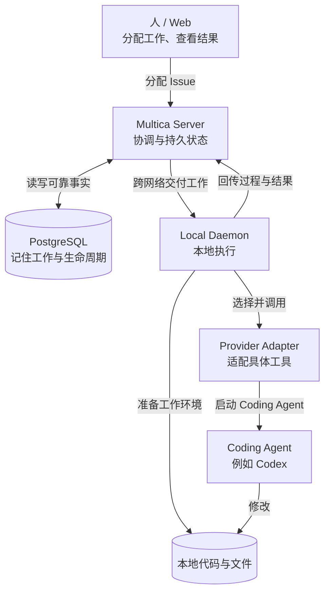
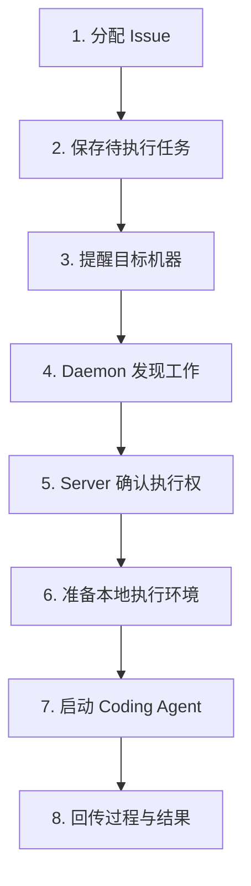
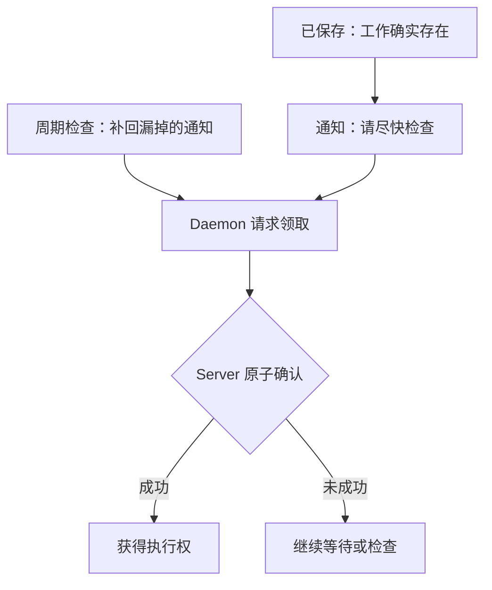
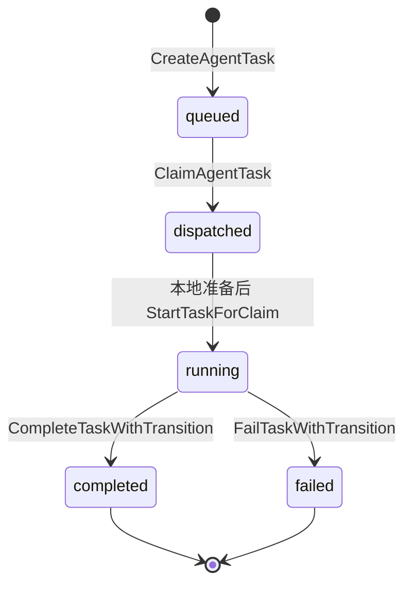
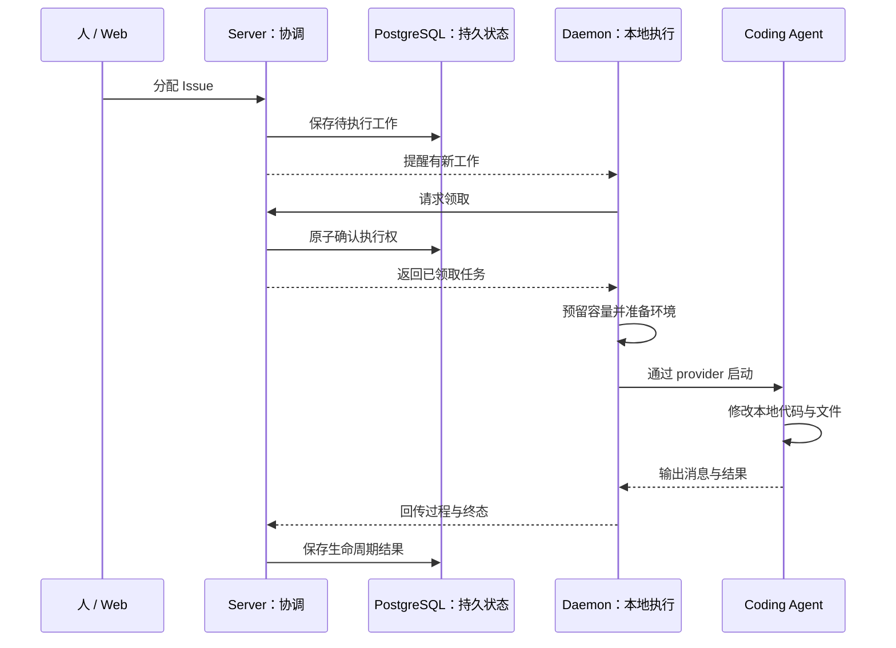

> 我只是在 Multica 中把一个 Issue 分配给 Agent，为什么几秒之后，我的 Mac 上就真的开始运行 Codex 了？

短答案是：**Multica Server 把这次执行先保存成一项不会随网络消息消失的工作，再提醒你的 Mac；Mac 上的 Daemon 领取工作、准备仓库与运行环境，最后才通过 provider 边界启动 Codex。**

所以，这不是浏览器隔着网络“遥控 Codex”。它是一场跨越服务端、数据库、本地进程和 Coding Agent 的接力。本章会先看整台机器，再跟随一项工作走完全程，最后才进入函数名与源码路径。

本章只讲研究已经验证的普通直接分配主路径。上游基线固定为 `multica-ai/multica@b4ca5b4a23e68b26292a680dca7689a952bb1cd5`。

## 先看整台机器

先忽略源码名字，只看职责。下面是本章使用的**教学图**；图中的中文标签表达架构含义，不声称存在同名的源码类型。

<figure>



<figcaption><strong>TEACHING · 最小架构图：</strong>Server 负责协调与持久状态；Daemon 和 Coding Agent 在本地机器上完成真正执行。读图时先记住这条边界，不必记函数名。</figcaption>

</figure>

这张图里有三个最重要的角色：

- **Multica Server** 管“谁在做什么”：工作是否存在、交给哪个 Agent、执行走到哪个阶段，以及协作与调度记录。Server 不是 Coding Agent，也不会代替 Codex 修改你的仓库。
- **持久状态（durable state）**让 Server 在网络通知丢失后仍记得工作存在。本章只需要知道这些事实保存在 PostgreSQL；数据库内部的更多设计不是本章主题。
- **Local Daemon** 是用户机器上的执行侧进程。它连接服务端编排与本地仓库、文件、凭据和 Coding Agent 可执行文件。

Multica 也不替代 Codex、Claude Code 或其他 Coding Agent。Daemon 先走到统一的 provider/backend 边界，再由具体适配器启动已配置的工具。真正被修改的代码始终位于执行侧的本地工作环境中。

## 一项工作怎样跑完全程

假设你把一个普通 Issue 分配给一个已配置好 runtime 的 Agent，并选择开始执行。先不要看源码，整段旅程只有八步：

1. 用户把 Issue 分配给 Agent。
2. Server 把“需要执行这件事”保存成待执行任务。
3. Server 提醒目标机器：有新工作可以检查。
4. Daemon 被提醒，或在下一次主动检查时发现工作。
5. Daemon 向 Server 请求领取；Server 成功确认后，它才获得执行权。
6. Daemon 在本地预留容量，并准备仓库、工作目录和执行环境。
7. Multica 根据 Agent 的 runtime/provider 配置启动 Codex。
8. 执行消息、进度和最终结果经 Daemon 返回 Server。

<figure>



<figcaption><strong>TEACHING · 端到端旅程：</strong>一项工作按“保存 → 通知 → 发现 → 领取 → 准备 → 执行 → 回传”跨过网络与进程边界；这是语义阶段图，不是函数调用链。</figcaption>

</figure>

这八步已经回答了开头的问题。接下来要解释的是：为什么不能少掉中间那些看似绕路的步骤？

## 为什么不能只发一条“RUN NOW”

最朴素的方案是：Server 给笔记本发送 `RUN NOW`，笔记本收到就启动 Codex。但真实环境里至少有五个问题：

- 通知可能在断网或重连时丢失。
- 机器可能暂时离线，但工作仍应保留。
- 多个执行者可能几乎同时看到同一项工作。
- 本地并发容量可能已经用满。
- 一条瞬时通信和“一项工作确实存在”不是同一种事实。

如果通知本身就是任务，通知丢了，任务也丢了；如果看到通知就算拥有任务，多个执行者可能重复启动。因此 Multica 把三件事拆开：**先记下来，再通知，再认领。**

下面的教学伪代码先暴露整体控制流。它不是 Multica 原始源码，也省略了校验、错误处理和兼容路径。

```text
# 教学伪代码：不是 Multica 原始源码

任务 = 保存待执行工作()
提醒目标机器(任务)

while Daemon 有可用容量:
    任务 = 尝试领取工作()

    if 没有领到:
        等待通知或下一次检查
        continue

    准备本地执行环境(任务)
    标记任务开始运行(任务)
    启动已配置的 Coding Agent(任务)
    回传过程与最终结果(任务)
```

接下来每节只回答其中一个问题。

## 为什么先保存，再通知？

Server 接受一次满足触发条件的分配后，会先创建一条状态为 `queued` 的持久任务。产品界面把一次 Agent 执行称为 **Run**；当前实现里却主要使用 task 术语：数据库表是 `agent_task_queue`，Go 模型是 `db.AgentTaskQueue`，贯穿 API 的标识是 `task_id`。源码中没有一个承担全局中心角色的 `Run` 类型。

这条任务会记录 `agent_id`、`runtime_id`、`issue_id` 和 `status` 等信息。`runtime_id` 来自 Agent 当时绑定的 runtime，因此它不是一条任意在线机器都能抢走的通用任务。机器暂时离线不一定阻止入队；真正领取时还会检查 runtime 是否在线、心跳是否足够新鲜，以及 Agent 是否仍绑定到它。

先写入 `queued`，再发送提醒，意味着：即使后面的网络提醒没有送达，工作仍然存在。Daemon 以后还能从 Server 的持久事实中重新发现它。

> 源码坐标：`server/internal/service/task.go` 的 `(*TaskService).enqueueIssueTaskWithCommentPlan` 组织入队；`server/pkg/db/queries/agent.sql` 的 `CreateAgentTask` 写入 `status='queued'`。

并非每次修改 assignee 都会启动执行。`(*IssueService).WillEnqueueRun` 会检查 assignee、`backlog`、runtime 绑定、归档、访问、自循环和已有 pending task 等条件；`suppress_run` 还能表达“只分配、不启动”。本章从这里开始只讨论通过这些条件的普通直接分配。

## 为什么收到通知还不算拥有任务？

任务持久化之后，Server 会发送一次**尽力而为的唤醒通知（best-effort wakeup）**。它的意思只是“可能有新工作，请尽快检查”，而不是“这项工作已经属于你”。通知可以丢失，也可以重复；它不改变任务状态。

真正的执行权来自**原子认领（atomic claim）**：Server 在数据库中选择仍符合条件的 `queued` 任务，并把它变成 `dispatched`。选择候选和改变状态构成同一个不可分割的边界；并发执行者不会都成功拿走同一项工作。

<figure>



<figcaption><strong>TEACHING · 通知与所有权：</strong>通知只加速发现，周期检查只恢复发现；只有 Server 的原子确认才授予执行权。精确实现坐标放在文末。</figcaption>

</figure>

把这段逻辑压缩成伪代码：

```text
# 教学伪代码：不是 Multica 原始源码

候选 = 锁定一项仍可领取的 queued 任务

if 候选存在:
    在同一次数据库操作中把它改为 dispatched
    返回给唯一成功的领取者
```

实现中的关键 SQL 名为 `ClaimAgentTask`。它使用 `FOR UPDATE SKIP LOCKED` 选择候选，并在原子操作中执行 `queued → dispatched`；资格还包括 runtime 绑定、在线与心跳条件、并发容量和同一 Issue/Agent 的串行约束。

WebSocket 在这里有两个容易混淆的角色：`daemon:task_available` 是前面的唤醒事件；后面的 `tasks.claim` 则可以由 WebSocket RPC 承载。传输通道不是所有权语义，所有权仍以 Server 成功完成数据库 claim 为准。

## 为什么 Daemon 还要主动检查？

通知走的是快速路径：正常送达时，Daemon 几乎立刻开始检查。主动检查，也就是轮询（polling），走的是安全发现路径：即使通知丢失或连接刚刚恢复，Daemon 仍会周期性询问 Server 是否有可领取的工作。

因此两者不是竞争方案：

| 机制 | 解决的问题 | 不能保证什么 |
| --- | --- | --- |
| 唤醒通知 | 缩短正常情况下的等待时间 | 不保证送达，不授予执行权 |
| 周期检查 | 从漏通知或断连中重新发现工作 | 发现后仍不等于领取成功 |
| 原子认领 | 在并发条件下确认唯一执行权 | 不负责准备本地环境 |

Daemon 优先通过现有 WebSocket 发起 `tasks.claim` RPC，安全失败时可回退到 HTTP claim 路径。无论请求从哪条传输通道到达，最终都必须经过同一类 Server 端认领语义。

> 源码坐标：`(*Hub).NotifyTaskAvailable` 发送唤醒；`(*Daemon).pollLoop` 与 `(*Daemon).runBatchPoller` 负责被唤醒和周期检查；`(*Daemon).claimTasksWSFirst` 选择 claim 传输；`ClaimAgentTask` 决定所有权。

## 为什么领取以后还不能立刻启动 Codex？

因为“Server 已经把任务交给这台机器”和“这台机器已经准备好运行”是两个时刻。

Daemon 会先预留本地 task slot，再向 Server 请求领取。这条顺序很重要：如果本地容量已经满了，就不应先把服务端任务变成 `dispatched`。领取成功后，Daemon 还要根据任务的 `RuntimeID` 找到本地 provider，并由 `execenv.Prepare` 或复用路径准备工作目录和执行环境。

只有环境准备完成，Daemon 才调用 start endpoint。Server 的 `StartTaskForClaim` 会核对这一次 claim 的 `runtime_id` 与 `dispatched_at`，再把 `dispatched` 改成 `running`。因此本章里的 `running` 更接近“本地环境已经准备好，可以执行”，而不是“刚刚收到了一条消息”。

普通直接分配主路径的状态如下。这是一张**实现图**，状态值和转换点都属于固定 commit 下的真实实现。

<figure>



<figcaption><strong>IMPLEMENTATION · task 主路径状态：</strong><code>queued → dispatched</code> 表示认领成功；环境准备和 start 成功后才进入 <code>running</code>。<code>[*]</code> 只是 Mermaid 起止记号，不是 Multica task 状态，也不表示终态后的数据库转换。</figcaption>

</figure>

`waiting_local_directory` 是一个已验证的可选分支：使用 in-place `local_directory` 且目录正被占用时，任务可以走 `dispatched → waiting_local_directory → running`。它不是所有任务的必经状态。`deferred` 用于定时或媒体门控路径，也不是普通直接分配的起点。

## Multica 怎样真正启动 Codex？

环境准备之后，Daemon 并不直接把所有执行逻辑写死成 Codex。`agent.Backend` 定义统一执行边界，`ResolveBackend` 根据 runtime 的 provider/协议配置解析出具体 backend。可以把两边的职责这样分开：

- 边界之前：领取任务、准备环境、维护生命周期。
- 边界之后：启动并与某一种 Coding Agent 交互。

对本章的 Codex 路径，已验证的落点是 `codexBackend.Execute`，随后启动：

```text
codex app-server --listen stdio://
```

Codex 子进程通过 stdin/stdout 上的 JSON-RPC 2.0 与 backend 通信。这里的 JSON-RPC 只需理解为：两个进程用结构化请求、响应和通知交谈。协议细节不影响本章主线。

到这一步，最初在网页上的 Issue 分配，才真正成为 Mac 上运行的 Codex 进程。Multica 负责跨边界协调，Codex 负责具体编码工作。

> 源码坐标：`server/pkg/agent/agent.go` 的 `Backend` 定义边界；`server/pkg/agent/builtin_runtimes.go` 的 `ResolveBackend` 解析 backend；`server/pkg/agent/codex.go` 的 `codexBackend.Execute`、`executeOnce` 和 `buildCodexArgs` 落到 Codex 进程。

## 结果怎样回来？为什么 task 完成不等于 Issue 完成？

执行期间，Daemon 从 provider session 读取消息，分批发到 `POST /api/daemon/tasks/{taskId}/messages`；粗粒度进度走单独的 `.../progress` endpoint。结束时，明确成功的结果发往 `.../complete`，其他结果发往 `.../fail`。Server 最终把 task 写成 `completed` 或 `failed`，并发布相应生命周期事件。

但 task 和 Issue 是两个对象：

```text
一次执行的生命周期：queued → dispatched → running → completed | failed

Issue 的协作流程：    todo → in_progress → in_review → done
```

task 的 `completed` 只表示这次 Agent 执行结束；它不会机械地把 Issue 改成 `done`。Coding Agent 会按工作流通过 CLI 更新 Issue，最终验收仍属于协作流程。反过来说，一个 Issue 也可能经历多次执行，不能用一条 task 状态替代整个协作状态。

本章的证据只覆盖到 Server 已提交的任务状态与生命周期事件；事件如何完整传播到所有实时 UI，不在当前研究范围内。

## 回到整张架构图

现在再看同一套系统，中间步骤已经有了含义：Server 先保存可恢复事实，再用通知加速；Daemon 通过认领获得执行权，在本地容量和环境就绪后跨过 provider 边界；Coding Agent 修改本地代码；Daemon 最后把过程与结果送回 Server。

<figure>



<figcaption><strong>TEACHING · 架构综合：</strong>Server 侧保存协调事实，本地侧完成真实执行；<em>保存、提醒、领取</em>是三个不同动作。图折叠了具体 API、函数和兼容分支。</figcaption>

</figure>

这个结构可以概括为“可靠事实 + 快速提示 + 明确所有权 + 本地执行”。前两项让断线不会轻易抹掉工作，认领约束并发，本地边界则让仓库与工具留在真正具备它们的机器上。

这段是对已验证机制的工程解释，不应扩写成作者对性能、完整重试策略或部署拓扑的主观设计声明。

## 容易混淆的五件事

1. **Server 不是 Coding Agent。** 它负责协调与记录；Codex 等工具在执行侧工作。
2. **产品 `Run` 不是源码中心类型 `Run`。** 当前实现主要使用 `agent_task_queue`、`TaskService` 和 `task_id` 等 task 术语。
3. **通知不是所有权。** `daemon:task_available` 只提示检查；成功 claim 才产生 `dispatched` 所有权。
4. **polling 不是认领。** 它负责重新发现工作；发现以后仍须 Server 原子确认。
5. **task 终态不是 Issue 终态。** `completed` 与 `done` 分属执行生命周期和协作流程。

## 可以带走的工程经验

- 先把不可丢的事实持久化，再用即时通知加速。
- 把“发现工作”和“获得执行权”分成两个清晰动作。
- 用原子状态迁移表达所有权变化，而不是依赖某个进程的内存标记。
- 先确认本地容量，再领取远端工作；先准备环境，再声明 `running`。
- 用 provider 边界隔离通用编排与具体 Coding Agent。
- 不要用一套状态解释执行对象与协作对象。

## 5 分钟快速复习

试着不用任何函数名回答：

1. Server、Daemon 和 Codex 各负责什么？
2. 为什么要先保存任务，再提醒机器？
3. 通知、轮询和认领分别解决什么问题？
4. 哪一步真正改变执行权？
5. 为什么领取后不能立即启动 Codex？
6. provider 边界隔开了哪两类职责？
7. 为什么一次执行结束不等于 Issue 已被验收？

如果能说出下面这句话，你已经掌握主线：

> Server 先保存工作并提醒机器；Daemon 发现后请求领取，Server 原子确认执行权；Daemon 再准备本地环境、通过 provider 启动 Coding Agent，并把结果送回 Server。

## 想继续读源码？

到这里，读者侧的解释已经完整。下面是用于核对实现的精确源码坐标；不需要为了理解主线而记忆它们。

### Source Map

所有实现条目均来自 `research/run-lifecycle/research-note.md`，证据等级为 `SOURCE`；产品术语与部分行为边界另有该研究中标注的 `DOCS` 支持。

| 源码位置 | 关键 symbol | 证明什么 |
| --- | --- | --- |
| `server/internal/handler/issue.go` | `(*Handler).UpdateIssue` | 保存 assignee 变化，并进入执行触发判断 |
| `server/internal/service/issue_trigger.go` | `(*IssueService).WillEnqueueRun` | 判断当前分配是否允许入队 |
| `server/internal/handler/issue_trigger.go` | `(*Handler).dispatchIssueRun` | 把直接 Agent 触发交给 task 路径 |
| `server/internal/service/task.go` | `(*TaskService).enqueueIssueTaskWithCommentPlan` | 解析 runtime、创建任务、发布 queued 事件并提醒 runtime |
| `server/pkg/db/queries/agent.sql` | `CreateAgentTask` | 写入 `status='queued'` 的持久记录 |
| `server/internal/daemonws/hub.go` | `(*Hub).NotifyTaskAvailable` | 发送 best-effort 的 `daemon:task_available` 提示 |
| `server/internal/daemon/daemon.go` | `(*Daemon).pollLoop`, `(*Daemon).runBatchPoller` | 接收唤醒、周期检查，并在 claim 前预留本地容量 |
| `server/internal/daemon/wsrpc.go` | `(*Daemon).claimTasksWSFirst` | WebSocket RPC 优先，安全失败时回退 HTTP |
| `server/internal/service/task.go` | `(*TaskService).ClaimTasksForRuntimes`, `(*TaskService).claimTask` | 应用 runtime、Agent、容量与新鲜度条件 |
| `server/pkg/db/queries/agent.sql` | `ClaimAgentTask` | 原子执行 `queued → dispatched` |
| `server/internal/daemon/daemon.go` | `(*Daemon).handleTask`, `(*Daemon).runTask` | 路由本地 runtime、准备环境、确认 start、调用 provider |
| `server/internal/daemon/execenv/execenv.go` | `Prepare` | 建立 Coding Agent 使用的本地执行环境 |
| `server/internal/service/task.go` | `(*TaskService).StartTaskForClaim` | 校验 claim generation，并进入 `running` |
| `server/pkg/agent/agent.go` | `Backend`, `New`, `ExecOptions` | 定义统一 provider 执行边界 |
| `server/pkg/agent/builtin_runtimes.go` | `ResolveBackend` | 把 runtime/provider 配置解析为 backend |
| `server/pkg/agent/codex.go` | `codexBackend.Execute`, `executeOnce`, `buildCodexArgs` | 启动 `codex app-server --listen stdio://` |
| `server/internal/daemon/daemon.go` | `(*Daemon).executeAndDrain`, `(*Daemon).reportTaskResult` | 回传消息、进度和最终结果 |
| `server/internal/handler/daemon.go` | `ReportTaskMessages`, `CompleteTask`, `FailTask` | 接收 daemon 回传并进入服务端状态处理 |
| `server/internal/service/task.go` | `CompleteTaskWithTransition`, `FailTaskWithTransition` | 幂等写入 `completed` 或 `failed` 并发布事件 |

### 精确执行 / 调用链

下面是根据研究整理的 happy path，省略参数校验、日志与辅助调用：

```text
PUT /api/issues/{id}
  → Handler.UpdateIssue
  → IssueService.WillEnqueueRun
  → Handler.dispatchIssueRun
  → TaskService.EnqueueTaskForIssueWithHandoff
  → enqueueIssueTaskWithCommentPlan
  → CreateAgentTask(status = queued)
  → publish task:queued
  → EmptyClaim.Bump
  → NotifyTaskAvailable(runtime_id, task_id)
  → daemon taskWakeupLoop / pollLoop
  → runBatchPoller（先预留本地 slot）
  → claimTasksWSFirst
  → WS RPC tasks.claim，或 HTTP fallback
  → Handler.ClaimTasksByRuntime
  → TaskService.ClaimTasksForRuntimes
  → claimTask
  → ClaimAgentTask: queued → dispatched
  → daemon handleTask / runTask
  → execenv.Prepare 或复用已有环境
  → POST /api/daemon/tasks/{taskId}/start
  → StartTaskForClaim: dispatched → running
  → agent.ResolveBackend(...)
  → agent.Backend.Execute(...)
  → codexBackend.Execute / executeOnce
  → codex app-server --listen stdio://
  → POST .../messages 与 .../progress
  → reportTaskResult
  → POST .../complete 或 .../fail
  → CompleteTaskWithTransition 或 FailTaskWithTransition
  → completed 或 failed + lifecycle event
```

### 源码基线、研究依据与证据边界

- 上游仓库：`multica-ai/multica`
- 完整 commit SHA：`b4ca5b4a23e68b26292a680dca7689a952bb1cd5`
- 研究产物：`research/run-lifecycle/research-note.md`
- 图示证据：`research/run-lifecycle/diagram-evidence.md`
- 证据类型：实现结论以 `SOURCE` 为主；产品 Run/task 术语映射、Daemon 的轮询/心跳背景和 Issue 状态边界同时参考 `DOCS`。本章未新增 `EXPERIMENT`。

现有证据不足以完整解释：重试策略、stale dispatch recovery、heartbeat/离线恢复全生命周期、多实例 wakeup relay 与 Redis 细节、实时 UI 的完整事件传播、`execenv.Prepare` 的全部内部机制、claim payload/授权的所有字段，以及所有自定义 runtime/provider 行为。本章有意不把这些未决部分写成确定事实。
