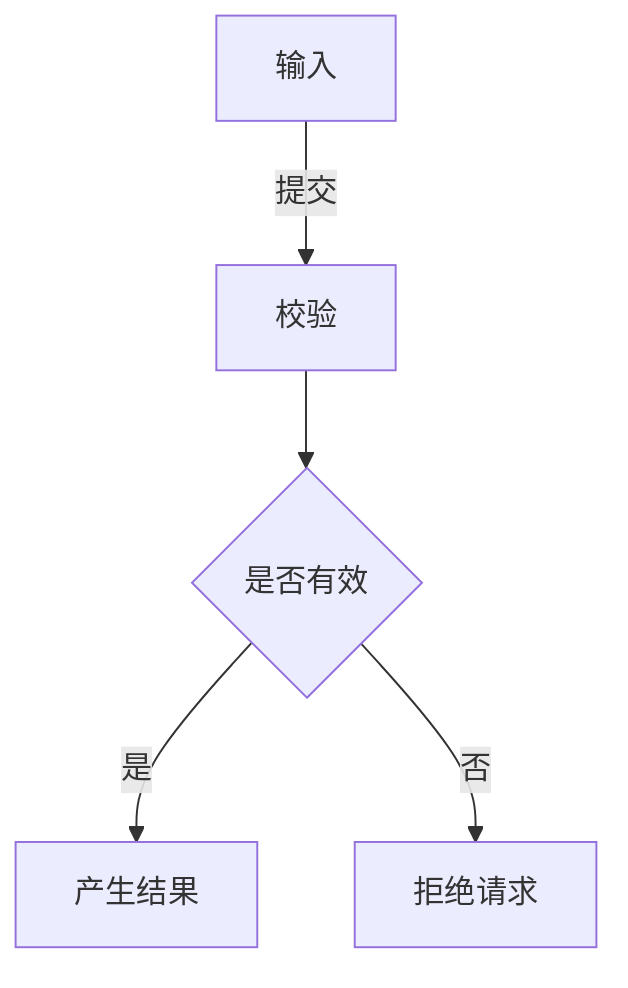
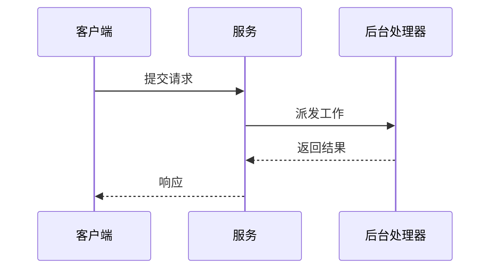
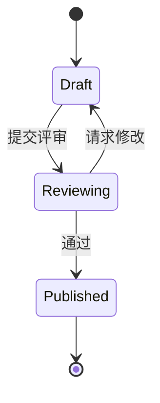

# 图类型选择

先写出图要回答的唯一读者问题，再选择语义最贴切的类型。不要因为 flowchart 最熟悉就默认使用它。

## `flowchart`

- **读者问题**：有哪些步骤、组件或边界，它们怎样连接或产生结果？
- **适合**：架构概览、处理流水线、职责边界、决策与因果关系。
- **不适合**：重点是参与者间严格的时间顺序，或一个对象的完整状态转换规则。

## `sequenceDiagram`

- **读者问题**：谁在什么时候调用谁，响应或事件按什么顺序返回？
- **适合**：API / RPC 流程、跨服务协作、事件传播、同步与异步交互、关键失败分支。
- **不适合**：只需要说明静态组成关系，或重点是单个对象允许哪些状态转换。

## `stateDiagram-v2`

- **读者问题**：一个对象有哪些状态，什么事件或条件触发转换？
- **适合**：任务或运行生命周期、恢复流程、带 guard 或终止状态的状态机。
- **不适合**：重点是多个角色之间的消息顺序，或只是展示处理步骤而没有严格的状态语义。

## 决策提示

同一主题可能需要多张图：先用 flowchart 建立边界，再用 sequence diagram 解释一次交互，最后用 state diagram 解释某个对象的生命周期。每张图仍只回答一个问题并保持一个抽象层级。
